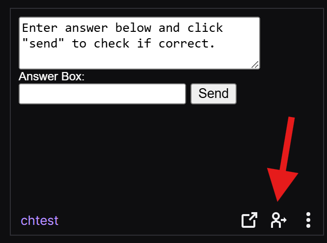
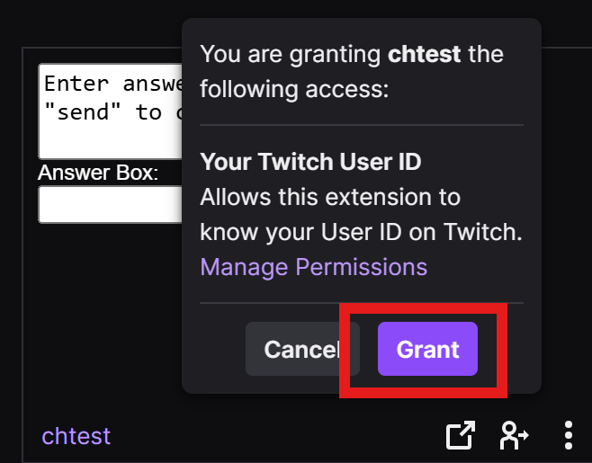

# Twitch Extension Permission

### Overview
The twitch extension uses your Twitch ID only for the purpose of your status in the game.

### Instructions
 - On the twitch extension panel, click the icon that looks like a person.
 

 

 - Click the **Grant** button to allow this extension to know your Twitch ID
 

